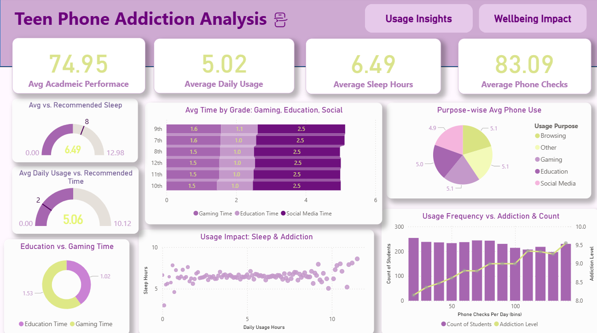
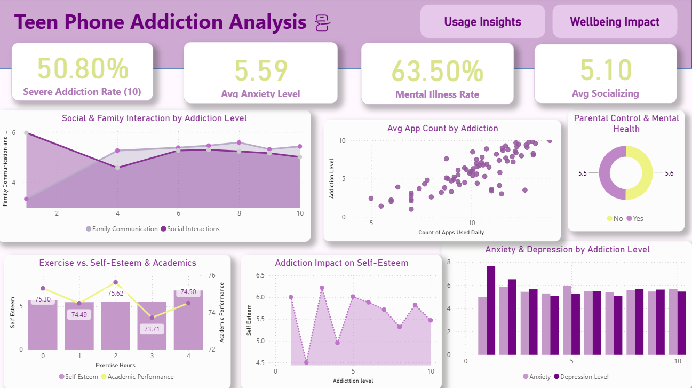

# Teen Phone Addiction Analysis

An end-to-end Data Science project analyzing how smartphone usage impacts teenagers' mental health, academic performance, and social behavior. This project combines data analysis, machine learning, and interactive visualization to uncover meaningful insights.

---

## Project Objective
To explore the relationship between phone usage and various aspects of teen life, and build predictive models to assess potential addiction or risk levels.

---

## Dataset
- Dataset of 3,000 teenagers
- Includes features related to:
  - Screen time
  - Academic performance
  - Mental health
  - Social activity

---

## Project Workflow
1. Data Cleaning & Preprocessing
   - Handled missing values
   - Encoded categorical variables
   - Feature scaling

2. Exploratory Data Analysis (EDA)
   - Identified patterns and correlations
   - Visualized key trends

3. Feature Engineering
   - Created features such as:
     - Mental Health Issue Level
     - Average Social Health Score

4. Machine Learning Models
   - Random Forest
   - XGBoost  
   - Compared performance to select the best model

5. Data Visualization
   - Built an interactive Power BI dashboard (2 pages) to present insights

---

## Dashboard Preview

### Page 1


### Page 2


---

## Key Insights
- Increased screen time is associated with lower academic performance  
- Higher phone usage correlates with increased mental health risk  
- Social health tends to decrease with excessive device usage  

---

## Machine Learning
- Models used: Random Forest, XGBoost
- Goal: Predict addiction or risk level based on behavioral features
- Achieved strong predictive performance after feature engineering and tuning

---

## Technologies Used
- Python (Pandas, NumPy, Scikit-learn, XGBoost)
- Power BI (Dashboard and Data Visualization)
- Jupyter Notebook
- Git and GitHub

---

## Presentation
A detailed project presentation is available in the repository:

presentation/insights.pptx

---

## How to Run
1. Clone the repository:
```bash
git clone https://github.com/your-username/Teen-Phone-Addiction-Analysis-Prediction.git
